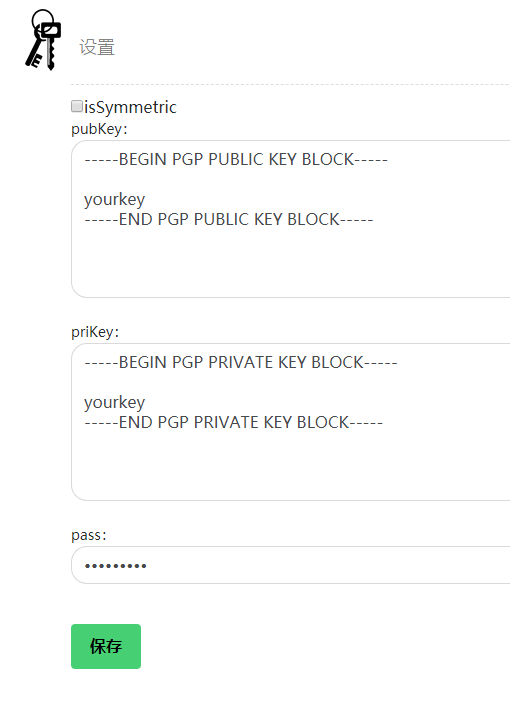

# GitGpgViewer
gpg decrypter chrome extension for github

# usecase
goto chrome://extensions/ , switch develop mode on ,and load the extension folder   
click the extension icon and set your publicKey/privateKey/passPharse and save.

then you can goto a gpg encrypt armored file page in github repositpry to see if it would be decrypted.

